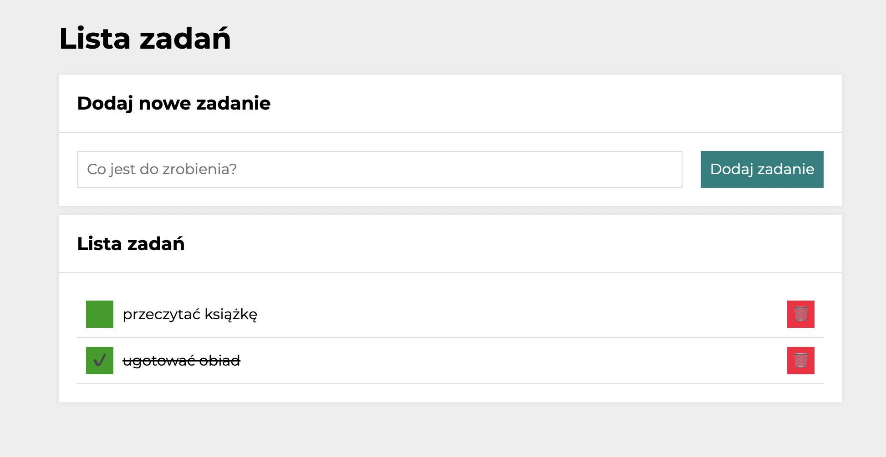

# to-do-list

I've created a to-do list that can help you manage your daily tasks :)

## DEMO

Take a look!

https://zofiajanczuk.github.io/to-do-list/

## Appearance

## How to use

- Click on the blue button to add a new task.
- Check the green mark to complete the task. You'll still be able to see it, but the text will be crossed out.
- Click on the red mark to remove the task from your list.

## Technologies used

- HTML
- CSS with BEM convention
- JavaScript
- Grid
- MediaQueries
